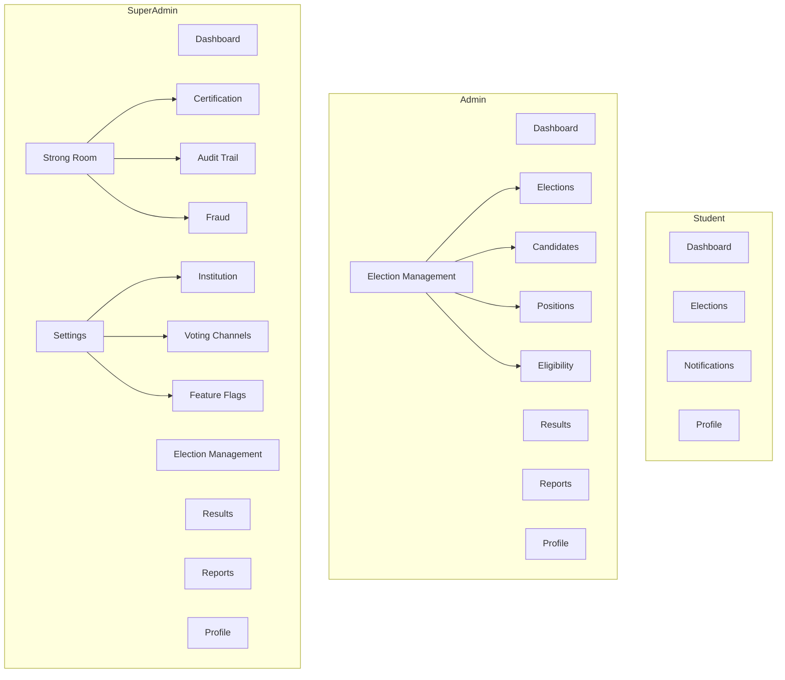

# Phase 23 — Enterprise UX & Navigation Consolidation

## A. Completion Report

Phase 23 reorganises VoteBridge navigation and dashboards so the product feels like a **modern university election platform**, not a system administration console. All backend APIs, services, repositories, models, and tests are preserved. No business features were removed — only navigation visibility and UI grouping changed.

**Delivered:**

- Consolidated sidebar per role (Student, Admin, Super Admin)
- Strong Room investigation workspace with module tabs
- Settings workspace (replaces System Control in primary navigation)
- Reports workspace (replaces Analytics in primary navigation)
- Operations health surfaced as dashboard widgets (deep links to existing Operations pages)
- Vue election management pages: create election, positions, candidates, voter eligibility
- Legacy Django election templates marked deprecated (not removed)
- Backward-compatible routes for `/analytics/*`, `/system-control/*`, `/operations/*`, etc.

## B. Architecture Compliance

- **No backend changes** to business logic, services, or repositories
- Vue components delegate to existing API clients and stores
- Election integrity rules unchanged (no rankings/totals while OPEN)
- Permission checks remain server-side; navigation changes are visibility-only

## C. Database Changes

None.

## D. APIs

No APIs removed or modified. Frontend `elections.js` extended with client methods for positions, candidates, and eligibility CRUD (calling existing REST endpoints).

## E. Vue Components

| Area | Files |
|------|-------|
| Navigation | `config/sidebarNav.js`, `config/moduleNav.js`, `config/systemControlHub.js` |
| Layouts | `layouts/StrongroomWorkspaceLayout.vue`, `layouts/SettingsWorkspaceLayout.vue` |
| Dashboard | `components/dashboard/PlatformHealthWidgets.vue` |
| Elections | `views/elections/ElectionCreateView.vue`, `views/election-management/*` |
| Strong Room | `views/strongroom/StrongroomCustodyHubView.vue`, `StrongroomEvidenceExportView.vue` |
| Settings | `views/settings/VotingChannelsSettingsView.vue`, `SettingsSystemHubView.vue` |

## F. Security Impact

- Security Center, Fraud, and Platform Logs remain accessible via Strong Room workspace
- Super Admin retains exclusive Strong Room and Settings sidebar entries
- Deep links to legacy URLs still work for bookmarked admin workflows

## G. Performance Impact

- Dashboard widgets fetch a single Operations overview (existing API)
- No additional polling; lazy-loaded route chunks unchanged

## H. Responsive Design Notes

- Sidebar collapses to icons on desktop; election management expands as nested group on mobile drawer
- Platform health widgets use responsive grid (1 → 2 → 3 columns)
- Election management forms use single-column layout on small screens

## I. Testing Strategy

```bash
python manage.py check
python manage.py test
cd frontend && npm run build
```

Manual smoke tests:

1. Each role sidebar shows only specified items
2. `/reports` and `/analytics/elections` both resolve
3. `/settings` and `/system-control/institution` both resolve
4. Strong Room tabs navigate without 404
5. Create election → add position → add candidate → eligibility record

## J. Deployment Notes

- No migrations or environment changes
- Frontend-only deploy sufficient
- Communicate navigation change to election officers before rollout

---

## Before Sidebar

### Student
Dashboard, Elections, Notifications, Security, Profile (footer), plus mixed items

### Admin
Dashboard, Elections, Results, Strongroom, Security, Fraud, Operations, Platform Logs, Analytics, Communications, USSD, Profile

### Super Admin
All admin items plus System Control

## After Sidebar

### Student
| Item | Route |
|------|-------|
| Dashboard | `/` |
| Elections | `/elections` |
| Notifications | `/notifications` |
| Profile | `/profile` |

### Admin
| Item | Route |
|------|-------|
| Dashboard | `/` |
| Election management | `/elections` (+ children) |
| Results | `/results` |
| Reports | `/reports` |
| Profile | `/profile` |

**Election management children:** Elections, Candidates, Positions, Voter eligibility

### Super Admin
| Item | Route |
|------|-------|
| Dashboard | `/` |
| Election management | `/elections` (+ children) |
| Results | `/results` |
| Reports | `/reports` |
| Strong room | `/strongroom` |
| Settings | `/settings` |
| Profile | `/profile` |

---

## Module Relocation Table

| Former sidebar module | New location |
|----------------------|--------------|
| Operations | Dashboard health widgets → `/operations/*` |
| Platform Logs | Strong Room → Audit Trail (`/strongroom/audit`) |
| Analytics | Reports (`/reports/*`); `/analytics/*` kept |
| Security Center | Strong Room → Security Timeline (`/strongroom/security`) |
| Communications | Settings (providers, templates) + Reports drill-down |
| USSD | Settings → Voting Channels (`/settings/voting-channels`) |
| System Control | Settings (`/settings/*`); `/system-control/*` kept |
| Fraud | Strong Room → Fraud Investigation |
| Trusted Devices | Strong Room → Trusted Devices |

---

## Strong Room Restructuring

```
Strong Room (/strongroom)
├── Vote integrity          (dashboard)
├── Certification           (/strongroom/certification)
├── Audit trail             (/strongroom/audit) — Platform Logs UI
├── Fraud investigation     (/strongroom/fraud)
├── Chain of custody        (/strongroom/custody)
├── Identity assurance      (/strongroom/identity)
├── Trusted devices         (/strongroom/trusted-devices)
├── Security timeline       (/strongroom/security)
└── Evidence export         (/strongroom/export)
```

---

## Settings Restructuring

```
Settings (/settings)
├── Overview
├── Institution
├── Authentication
├── Communication providers
├── Voting channels (Web, USSD, SMS, health, testing)
├── Maintenance
├── Feature flags
├── Backup
├── System configuration (runtime, environment, storage, audit)
├── Identity assurance (configuration)
├── Security policies
└── API & integrations
```

---

## Reports Restructuring

```
Reports (/reports)
├── Overview
├── Participation
├── Turnout
├── Results
├── Historical trends
└── Export reports

Advanced drill-downs remain at /analytics/students, /analytics/fraud, etc.
```

---

## Dashboard Simplification

**Admin & Super Admin dashboards now show:**

- Election status / open elections
- Turnout summary
- Security alerts (summary)
- System health widgets (link to Operations)
- Recent activity feed

Removed duplicate analytics charts and redundant quick-link bars from the Super Admin dashboard. Detailed metrics live under Reports and Strong Room.

---

## Navigation Diagram



---

## Vue Election Management (Part 12)

| Legacy Django page | Vue replacement | Status |
|--------------------|-----------------|--------|
| `/dashboard/elections/create/` | `/elections/create` | **Implemented** |
| `/dashboard/elections/{uuid}/positions/` | `/election-management/positions` | **Implemented** |
| `/dashboard/elections/{uuid}/candidates/` | `/election-management/candidates` | **Implemented** |
| `/dashboard/elections/{uuid}/eligibility/` | `/election-management/eligibility` | **Implemented** |

**Deprecation:** Legacy templates under `backend/templates/elections/` remain for backward compatibility but are **deprecated**. Use Vue routes for new election officer workflows. Templates will be removed in a future phase after parity verification.

---

## User Experience Improvements

1. **Role-appropriate navigation** — students see voting workflows only; admins see election operations; super admins see investigation and configuration workspaces.
2. **Logical grouping** — technical modules hidden behind Strong Room and Settings.
3. **Faster dashboards** — fewer duplicate KPIs; health issues surface as actionable tiles.
4. **Election-first language** — “Reports” and “Election management” replace enterprise jargon in primary nav.
5. **Backward compatibility** — existing bookmarks and integrations continue to work.

---

## No Backend Functionality Removed

All Operations, Analytics, Communications, USSD, Security, Platform Logs, System Control, and Strongroom APIs and services remain fully available. This phase is UI/navigation consolidation only.
