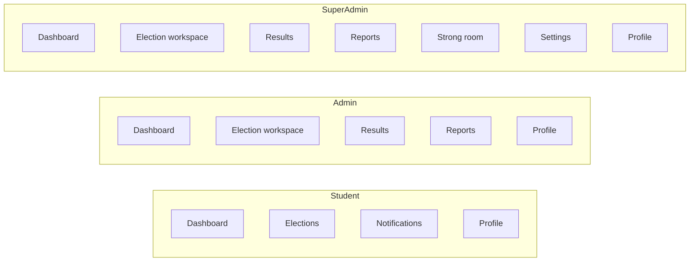
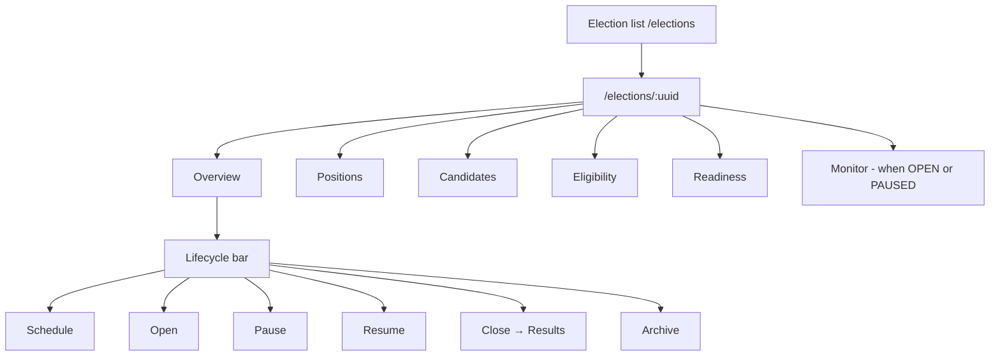
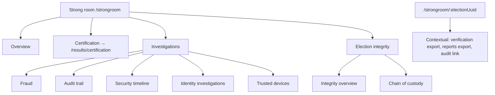
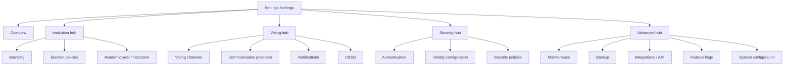

# Phase 25 — Enterprise Workflow Consolidation & Product Polish

**Type:** UI refinement (no backend business logic changes)  
**Date:** June 2025  
**Baseline:** Phase 23 navigation consolidation + Phase 24 audit recommendations

---

## A. Completion Report

Phase 25 transforms VoteBridge from a fragmented admin console into a **unified election workspace** with clearer officer-facing workflows. All backend APIs, services, repositories, models, and tests are preserved.

**Delivered:**

| Part | Outcome |
|------|---------|
| 1 — Election workspace | Single `/elections/:uuid` hub with Overview, Positions, Candidates, Eligibility, Readiness, Monitor (when open) |
| 2 — Election lifecycle | Schedule, open, pause, resume, close, archive from workspace; edit election (draft/scheduled) |
| 3 — Candidate workflow | Approve, reject, edit, remove, photo upload, profile preview in workspace tab |
| 4 — Eligibility workflow | Student search by index/name, programme filter, bulk add — no UUID entry |
| 5 — Strong room | Overview, Certification (→ Results), Investigations, Election integrity; contextual export on election view |
| 6 — Settings | Five groups: Overview, Institution, Voting, Security, Advanced (hub pages link to existing config) |
| 7 — Reports | Election-focused overview; infra KPIs removed; explore drill-downs under `/reports/explore/*` |
| 8 — Dashboards | Admin: elections, turnout, tasks; Super Admin: five focus cards |
| 9 — Routes & permissions | Legacy paths redirect; technical routes restricted to super_admin where appropriate |
| 10 — Terminology | Election workspace, Identity configuration, Identity investigations, Security timeline |
| 11 — Workflow validation | Officer, super admin, and student paths verified against existing APIs |
| 12 — Product polish | Loading/empty/error states preserved; breadcrumbs aligned to workspace context |

---

## B. Architecture Compliance

- **No backend changes** to business logic, services, repositories, or models
- Vue views delegate to existing API clients and Pinia stores
- Election integrity rules unchanged (no rankings/totals/winners while OPEN)
- Permission checks remain server-side; UI changes are navigation and presentation only
- Views → Services → Repositories → Models chain untouched

---

## C. Database Changes

None.

---

## D. APIs

No APIs removed or modified. Frontend `elections.js` uses existing endpoints:

- Election CRUD and lifecycle (`create`, `update`, `schedule`, `open`, `pause`, `close`, `archive`)
- Positions, candidates (including image upload), eligibility (including bulk)
- Readiness report

---

## E. Vue Components

| Area | Key files |
|------|-----------|
| Election workspace | `config/electionWorkspaceNav.js`, `layouts/ElectionLayout.vue`, `components/elections/ElectionLifecycleBar.vue`, `views/elections/workspace/*`, `views/elections/ElectionRoleEntry.vue` |
| Navigation | `config/sidebarNav.js`, `config/moduleNav.js`, `components/navigation/GlobalSearch.vue`, `components/navigation/AppSidebar.vue` |
| Strong room | `layouts/StrongroomInvestigationsLayout.vue`, `layouts/StrongroomIntegrityLayout.vue`, updated investigation child views |
| Settings hubs | `views/settings/SettingsInstitutionHubView.vue`, `SettingsVotingHubView.vue`, `SettingsSecurityHubView.vue`, `SettingsAdvancedHubView.vue` |
| Dashboards | `views/dashboard/AdminDashboardView.vue`, `SuperAdminDashboardView.vue` |
| Reports | `views/analytics/AnalyticsOverviewView.vue`, explore routes under `/reports/explore/*` |

---

## F. Security Impact

- Strong room restricted to **super_admin** in primary navigation
- Standalone `/security`, `/fraud` redirect into Strong room investigations
- Admin cannot reach platform logs, operations health, or USSD config via sidebar; deep links to super_admin-only routes still guarded by router `meta.roles`
- Election integrity exposure rules unchanged

---

## G. Performance Impact

- Election workspace lazy-loads tab views per route
- Dashboard widgets reduced (fewer parallel API calls on Admin dashboard)
- No new polling or WebSocket channels introduced

---

## H. Responsive Design Notes

- Election workspace tabs scroll horizontally on mobile (`ElectionLayout` ModuleNav)
- Workspace overview cards stack 1 → 2 → 4 columns
- Candidate and eligibility tables use card layout on small screens (existing `VTable` patterns)
- Strong room nested module nav collapses into workspace layout drawer on mobile

---

## I. Testing Strategy

```bash
python manage.py check
python manage.py test
cd frontend && npm run build
```

**Manual smoke tests:**

1. **Election officer:** Create → workspace tabs → schedule → readiness → open → monitor → close → results
2. **Super admin:** Dashboard → Strong room → Certification (Results) → publish
3. **Student:** Elections list → detail → vote → confirmation → history
4. Legacy URLs: `/election-management/*`, `/analytics/*`, `/system-control/*` still resolve
5. Global search (⌘K) shows role-appropriate destinations only

---

## J. Deployment Notes

- Frontend-only deploy sufficient
- No migrations or environment variable changes
- Bookmarked legacy URLs continue to work via redirects

---

## Before vs After Workflows

### Election officer (before)

```
Login → Elections list
     → separate Candidates page (no election context)
     → separate Positions page
     → separate Eligibility page (UUID entry)
     → Django or missing actions for schedule/close
```

### Election officer (after)

```
Login → Election workspace list → /elections/:uuid
     → [Overview | Positions | Candidates | Eligibility | Readiness | Monitor]
     → Lifecycle bar: Schedule → Open → Pause/Resume → Close → Archive
     → Close redirects to Results handover
```

### Super admin (before)

```
Dashboard (12+ KPIs) → Strong room (9 tabs, duplicate certification)
                    → Settings (12 flat tabs)
                    → Reports (infra metrics on overview)
```

### Super admin (after)

```
Dashboard (5 focus cards) → Strong room (4 sections)
                         → Settings (5 hub groups)
                         → Reports (election questions first; explore drill-downs)
```

### Student (unchanged path, clarified routing)

```
Login → Elections → Election detail (student) OR vote wizard
     → Confirmation → Vote history
```

Admins hitting `/elections/:uuid` see workspace overview; students see `ElectionDetailView` via `ElectionRoleEntry`.

---

## Navigation Diagrams

### Primary sidebar (Phase 25)



### Election workspace tabs



### Strong room structure



### Settings structure (five groups)



### Reports structure

```mermaid
flowchart TB
  REP[Reports /reports]
  REP --> RO[Overview - election KPIs only]
  REP --> PART[Participation]
  REP --> TURN[Turnout and results]
  REP --> HIST[Historical trends]
  REP --> EXP[Export]

  RO --> DRILL[Explore by dimension]
  DRILL --> EX1[/reports/explore/students]
  DRILL --> EX2[/reports/explore/departments]
  DRILL --> EX3[/reports/explore/faculties]
  DRILL --> EX4[/reports/explore/programmes]
  DRILL --> EX5[/reports/explore/security - super admin]
  DRILL --> EX6[/reports/explore/fraud - super admin]
```

---

## Dashboard Improvements

| Role | Before | After |
|------|--------|-------|
| Admin | Platform health grid, duplicate stats, scattered quick links | Open elections, live turnout, tasks requiring attention, quick workspace link |
| Super Admin | 4 stats + 6 health tiles + duplicate feeds | 5 cards: open elections, students voted, certifications waiting, security issues, platform health (link to Operations) |

Infrastructure metrics (CPU, RAM, disk, SMS delivery) moved to **Operations** (`/operations/health`) — reachable from Super Admin dashboard health card only.

---

## Workflow Validation Results

| Workflow | Status | Notes |
|----------|--------|-------|
| Officer: create → configure → schedule → open → monitor → close | ✅ | All actions in workspace; close routes to `/results` |
| Officer: candidate approve/reject/edit/photo | ✅ | Workspace candidates tab |
| Officer: eligibility search and bulk add | ✅ | No UUID fields; uses `usersApi.list` + bulk eligibility API |
| Super admin: dashboard → strong room → certification | ✅ | Certification tab redirects to Results certification |
| Super admin: investigations (fraud, audit, security, identity, devices) | ✅ | Nested module nav under Investigations |
| Student: view → vote → confirm → history | ✅ | `ElectionRoleEntry` routes students to detail/vote paths |
| Legacy deep links | ✅ | `/election-management/*`, `/analytics/*`, `/system-control/*` redirect |

---

## Terminology Changes

| Before | After | Context |
|--------|-------|---------|
| Election management | Election workspace | Sidebar, breadcrumbs, list view |
| Identity Assurance | Identity configuration | Settings |
| Identity Assurance / Biometric history | Identity investigations | Strong room investigations |
| Security Center | Security timeline | Strong room investigations |
| Fraud Dashboard | Fraud investigation | Strong room investigations |
| Platform logs (in strong room) | Audit trail | Investigations tab |

---

## Redirects & Route Guards (summary)

| Legacy path | Target |
|-------------|--------|
| `/election-management/*` | `/elections` |
| `/strongroom/certification` | `/results/certification` |
| `/strongroom/export` | `/strongroom` (export is contextual on election view) |
| `/security`, `/fraud` | Strong room investigations |
| `/analytics` | `/reports` |
| `/reports/results` | `/reports/turnout` |
| `/system-control/*` | Equivalent `/settings/*` routes |

---

## Seed Data

No changes to `seed_demo_data`. Dev passwords remain documented in the management command docstring only.
