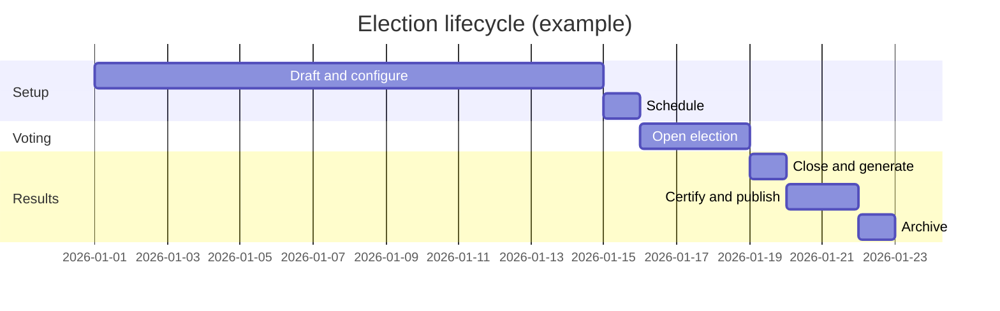

# VoteBridge — Election Lifecycle (Complete Guide)

A **plain-language walkthrough** of how an election happens in VoteBridge, from creation to published results. Each phase lists **who does it**, **what happens**, and **which privilege** is required.

> **Aligned with:** [PRIVILEGES-AND-ROLES.md](./PRIVILEGES-AND-ROLES.md) (July 2026).

---

## Overview timeline



---

## Phase 1 — Platform preparation (before any election)

| Who | Super Admin |
|-----|-------------|
| **Privilege** | `CanAccessSystemControlCenter` |

**What happens:**
1. Configure institution name, logo, and colors (**Institution** hub)
2. Set up SMS / email / USSD providers (**Integrations** hub)
3. Configure authentication, MFA, and API policies (**Security** hub)
4. Enable feature flags and environment settings (**Advanced** hub)
5. Create Admin accounts and assign roles (**Election Governance** hub — user management)
6. Import or create student accounts with index numbers

Settings are organized into **six hubs** (Institution, Security, Integrations, Election Governance, Operations, Advanced). Day-to-day ballot setup stays in the **Admin election workspace**, not Settings.

**Layman:** The ICT team prepares the “building” before any election can run.

---

## Phase 2 — Election creation (Draft)

| Who | Admin |
|-----|-------|
| **Privilege** | `CanManageElections` |

**What happens:**
1. Admin creates a new election (title, type, dates)
2. Status = **Draft**
3. Election is not visible to students yet

**Example:** “SRC General Elections 2026”

---

## Phase 3 — Ballot setup

| Who | Admin |
|-----|-------|
| **Privileges** | `CanManagePositions`, `CanManageCandidates`, `CanManageVoterEligibility` |

**What happens:**

### Positions
Add offices students will vote for:
- President (pick 1)
- General Secretary (pick 1)
- etc.

### Candidates
Add approved candidates per position (name, department, photo, manifesto).

### Eligibility
Define which students can vote:
- Register voters individually
- **Bulk import** CSV or Excel (`POST .../eligibility/import/` and bulk assign endpoints)
- Mark eligible / not eligible
- Verification step for large lists

### Channels (Super Admin for writes)
Enable **Web**, **USSD**, and/or **SMS** for this election type.

**Layman:** Building the ballot paper before printing.

---

## Phase 4 — Schedule

| Who | Admin |
|-----|-------|
| **Privilege** | `CanManageElections` |

**What happens:**
1. Set official start and end date/time
2. Move status: **Draft → Scheduled**
3. Readiness checks warn if positions or candidates are missing

---

## Phase 5 — Open election

| Who | Admin |
|-----|-------|
| **Privilege** | `CanManageElections` |

**What happens:**
1. Admin runs readiness validation
2. Clicks **Open Election**
3. Status = **Open**
4. USSD PINs may be generated for eligible voters
5. WebSocket broadcasts `election.opened`
6. Students see the election on their dashboard

**Critical rule:** While **Open**, nobody sees vote counts or winners anywhere in the system.

---

## Phase 6 — Student voting (Web)

| Who | Student / Candidate |
|-----|---------------------|
| **Privileges** | `CanRequestSVT`, `CanVote` |

### Step-by-step

| Step | Action | System behavior |
|------|--------|-----------------|
| 1 | Student logs in | Index number + OTP |
| 2 | Clicks **Vote Now** | Checks `VoterEligibility` |
| 3 | Requests voting code | `SVTService.request_svt()` → SMS sent |
| 4 | Enters SVT on verify page | `validate_and_start_ballot()` → session **Validated** |
| 5 | Presence capture (web only) | Camera detects face → photo saved → `PreVotePresenceCapture` |
| 6 | Views ballot | `BallotService.get_ballot()` — blocked until step 5 done |
| 7 | Selects candidates | Selections saved locally in browser |
| 8 | Reviews and submits | `VoteService.submit_ballot()` |
| 9 | Sees receipt | Confirmation reference (e.g. VTB-2026-000123) |

### What gets saved
- One `Vote` row per candidate selected
- Each vote has a **SHA-256 hash** for integrity
- SVT marked **Used**
- `BallotSeal` in strongroom
- `MFALog` entries (SVT validated, presence captured, votes cast)
- Live admin notification (sanitized — no rankings)

### Session limits
- SVT code expires (default ~10 minutes if not validated)
- Ballot session expires (default ~15 minutes after validation)
- Student can **Continue Ballot** if session still active

---

## Phase 6b — Student voting (USSD)

| Who | Student |
|-----|---------|
| **Channel** | Phone USSD menu |

**Differences from web:**
- No presence photo
- Uses `ElectionVoterPin` instead of typing SVT in browser
- Same `Vote` and `SVTToken` models underneath
- Same integrity rules

**Privilege:** Same voter eligibility; channel must be enabled for election.

---

## Phase 7 — Monitoring (while Open)

Monitoring is **split by scope** — Admin sees assigned elections; Super Admin sees the full platform.

### Admin (election-scoped)

| **Privileges** | Election workspace monitor, `CanAccessElectionOperations`, `CanViewSecurityMonitoring`, `CanViewFraudCases` |

**What admins see:**
- Turnout trends for **their elections** (aggregate, not per-candidate rankings)
- Per-election control room and **per-election WebSocket**
- Security alerts and fraud cases within operational scope
- Communications delivery logs (read-only for election-related traffic)

**What admins do NOT see while Open:**
- Who is winning
- Live candidate rankings
- Platform Operations Center (health, queues, sessions, infrastructure)
- Strong Room, USSD, or Communications **realtime feeds**

### Super Admin (platform + elections)

All Admin election monitoring, plus:
- **Operations Center** (`CanAccessPlatformOperationsCenter`) — platform health, queues, sessions, logs
- Strong Room, Communications, and USSD **WebSocket feeds**
- Communications queue process / retry / provider tests
- Platform-wide fraud and security investigation (Settings → Security area)

---

## Phase 8 — Pause (optional)

| Who | Admin |
|-----|-------|
| **Status** | **Paused** |

Temporarily stops new voting. Used for technical issues or institutional decision. Can resume to **Open**.

---

## Phase 9 — Close election

| Who | Admin |
|-----|-------|
| **Privilege** | `CanManageElections` |

**What happens:**
1. Status = **Closed**
2. No more votes accepted
3. System triggers **automatic result generation**
4. WebSocket: `election.closed`

---

## Phase 10 — Result generation

| Who | System (automatic) |
|-----|-------------------|

**What happens:**
1. Count votes per candidate per position
2. Build `standings` JSON on `ElectionResult`
3. Compute `result_hash` and turnout percentage
4. Run integrity checks:
   - Vote hash validation
   - SVT consistency
   - Duplicate ballot detection
   - Fraud case review flags
5. Status → `pending_certification` or `generated` (if issues)

**Privilege to view:** Admin and Super Admin see all statuses; students see nothing yet.

---

## Phase 11 — Certification

| Who | Super Admin |
|-----|-------------|
| **Privilege** | `CanCertifyResults` |

**What happens:**
1. Super Admin reviews integrity report
2. May require **biometric step-up**
3. Certifies results officially
4. Strongroom creates **ElectionSeal**
5. Status → **Certified**

**Layman:** The registrar signs off that the count is correct.

---

## Phase 12 — Publication

| Who | Super Admin |
|-----|-------------|
| **Privilege** | `CanPublishResults` |

**What happens:**
1. Results become visible to students and public portal
2. Standings show winners per position
3. WebSocket notifies subscribers
4. Status → **Published**

**Students** (`CanViewPublishedResults`): Can now see who won.

---

## Phase 13 — Archive

| Who | Super Admin |
|-----|-------------|
| **Privilege** | `CanArchiveResults`, election archive |

**What happens:**
1. Election status → **Archived**
2. Results status → **Archived**
3. Historical record preserved for audit

---

## Maintenance — Operational data reset (non-production / recovery)

| Who | Super Admin |
|-----|-------------|
| **Privilege** | `CanAccessSystemControlCenter` (Settings → Operations → Operational data reset) |

**What happens:**
1. Super Admin selects scope (e.g. purge one election or full platform reset)
2. `data_reset_service` / `election_purge_service` remove elections, votes, results, SVT tokens, presence captures, and related records
3. User accounts and institution settings are preserved (unless a full dev reset command is used)

**Layman:** A “factory reset” for election data — used in development, staging, or after a test run. Not part of the normal election lifecycle.

For local development, `python manage.py reset_votebridge_dev --force` rebuilds demo data and documents dev OTP fallback in its docstring.

---

## Strongroom parallel track

Runs alongside results for integrity:

| Stage | Action |
|-------|--------|
| On each ballot submit | `BallotSeal` created |
| Committee nomination | Admin proposes custodians |
| Committee approval | Super Admin approves |
| Vault access | Super Admin opens vault session |
| After certification | `ElectionSeal` links all ballots |
| Public verification | Anyone can verify seal hash (public endpoint) |

---

## Role summary across the lifecycle

| Phase | Student | Candidate | Admin | Super Admin |
|-------|---------|-----------|-------|-------------|
| Setup platform | — | — | — | ✓ |
| Create election | — | — | ✓ | ✓ |
| Open voting | — | — | ✓ | ✓ |
| Vote | ✓ | ✓ | — | — |
| View candidacy | — | ✓ (own races) | — | — |
| Monitor (election) | — | — | ✓ | ✓ |
| Monitor (platform ops) | — | — | — | ✓ |
| Close | — | — | ✓ | ✓ |
| Certify results | — | — | — | ✓ |
| Publish results | — | — | — | ✓ |
| Vault / strongroom | — | — | nominate | ✓ approve & access |
| Data reset | — | — | — | ✓ |

---

## Data created during one student vote

```
User (student)
  └── SVTToken (issued → validated → used)
        └── PreVotePresenceCapture (web only)
        └── Vote (one per selection)
              └── vote_hash
        └── BallotSeal
        └── MFALog events
```

---

## Integrity rules (never broken)

1. **No results while OPEN** — enforced in services, API, WebSocket sanitizer, and Vue UI
2. **One vote per position rules** — enforced by `max_votes_allowed` and unique constraints
3. **Eligibility required** — checked on SVT request, ballot view, and submit
4. **SVT required** — cannot submit without validated token
5. **Presence required (web)** — cannot open ballot without photo
6. **Immutable votes** — votes are not updated after creation

---

## Related documents

| Document | Content |
|----------|---------|
| [FLOWCHARTS.md](./FLOWCHARTS.md) | Visual diagrams |
| [PRIVILEGES-AND-ROLES.md](./PRIVILEGES-AND-ROLES.md) | Full permission list |
| [ERD.md](./ERD.md) | Database tables |
| [USE-CASE-DIAGRAM.md](./USE-CASE-DIAGRAM.md) | Actor use cases |
| [TECH-STACK.md](./TECH-STACK.md) | Technologies explained |
| [README.md](./README.md) | Documentation index |
