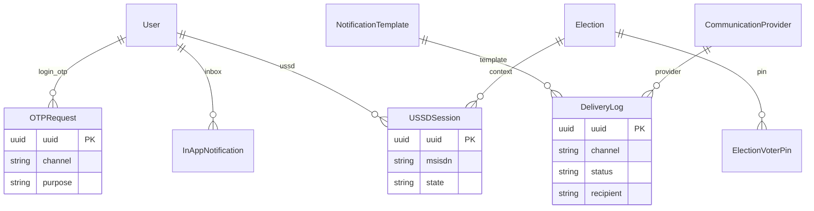
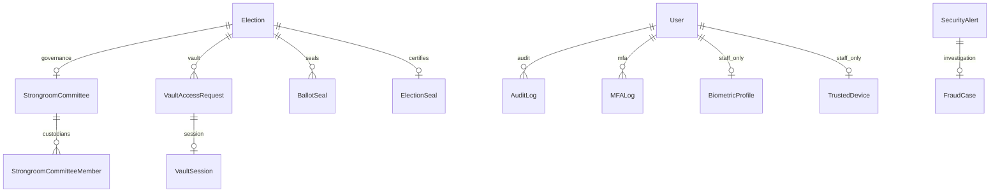

# VoteBridge — Entity Relationship Diagram (ERD)

An **ERD** shows how data is stored in PostgreSQL and how tables relate. This document matches the **presentation-ready prototype** and the live Django models.

> **Prototype focus:** Core entities below power the demo flows (login → vote → results; admin election workspace). Supporting/governance entities remain in the database but are not primary UI surfaces. See [SYSTEM-DOCUMENTATION-INDEX.md](../SYSTEM-DOCUMENTATION-INDEX.md) for core vs advanced documentation layers.

---

## Prototype core entities (what the demo shows)

| Entity | Role in prototype |
|--------|-------------------|
| `User` + `Role` | Students, candidates, admins, super admins |
| `Election` | Election lifecycle (draft → open → closed) |
| `Position` | Offices on the ballot |
| `Candidate` | Contestants per position (not a separate power tier) |
| `VoterEligibility` | Who may vote in which election |
| `SVTToken` | Secure Voting Token — ballot session |
| `PreVotePresenceCapture` | Web pre-vote presence photo |
| `Vote` | Immutable ballot selections |
| `ElectionResult` | Aggregated standings; certification / publication |
| `DeliveryLog` / `OTPRequest` | SMS/OTP for login and SVT |
| `USSDSession` | Phone voting path |
| `ElectionVoterPin` | USSD election PIN |

**Candidate role note:** `Role.candidate` is a **student voter account** with candidacy visibility — not a governance tier. The `candidates_candidate` table stores **election contestant records** (name, manifesto, position) managed by admins; it is not the same as the user role flag.

---

## Core ERD (election & voting)

```mermaid
erDiagram
    Role ||--o{ User : assigns
    User ||--o{ VoterEligibility : eligible_in
    User ||--o{ OTPRequest : receives_otp
    User ||--o{ SVTToken : receives_svt
    User ||--o{ Vote : casts
    User ||--o{ PreVotePresenceCapture : presence_photo

    Election ||--o{ Position : contains
    Election ||--o{ Candidate : has_contestants
    Election ||--o{ VoterEligibility : defines_roll
    Election ||--o{ Vote : receives
    Election ||--o{ SVTToken : authorizes
    Election ||--o| ElectionResult : produces
    Election ||--o{ ElectionVoterPin : ussd_pins

    Position ||--o{ Candidate : contested_by
    Position ||--o{ Vote : position_scope

    Candidate ||--o{ Vote : receives_selection

    VotingChannel ||--o{ Vote : channel

    SVTToken ||--o| PreVotePresenceCapture : session
    Vote }o--o| SVTToken : linked_by_svt_id

    USSDSession }o--|| User : optional_user
    DeliveryLog }o--o| User : notification_target

    Role {
        uuid uuid PK
        string name
    }

    User {
        uuid uuid PK
        string email
        string index_number
        string phone_number
        fk role_id
    }

    Election {
        uuid uuid PK
        string title
        string status
        datetime start_date
        datetime end_date
    }

    Position {
        uuid uuid PK
        string title
        int max_votes_allowed
    }

    Candidate {
        uuid uuid PK
        string full_name
        string status
        fk election_id
        fk position_id
    }

    VoterEligibility {
        uuid uuid PK
        bool is_eligible
        fk user_id
        fk election_id
    }

    Vote {
        uuid vote_id PK
        string vote_hash
        uuid svt_id
        datetime timestamp
    }

    SVTToken {
        uuid svt_id PK
        string token_code
        string status
    }

    PreVotePresenceCapture {
        uuid uuid PK
        uuid svt_id
        image image
    }

    ElectionResult {
        uuid uuid PK
        string status
        json standings
    }
```

---

## Communications & USSD (prototype-relevant)



---

## Supporting / governance entities (not primary prototype UI)

These tables exist for platform integrity, audit, and advanced governance. They are **not** main navigation in the campus e-voting demo.



| App | Tables | Purpose |
|-----|--------|---------|
| **strongroom** | `StrongroomCommittee`, `VaultSession`, `BallotSeal`, `ElectionSeal`, … | Post-close vault governance |
| **security** | `AuditLog`, `DeviceLog`, `LocationLog` | Security monitoring |
| **fraud** | `FraudCase` | Investigation workflow |
| **biometrics** | `BiometricProfile` | Staff step-up (optional) |
| **trusted_devices** | `TrustedDevice` | Privileged device trust |
| **system** | `InstitutionProfile`, `SystemSetting`, `FeatureFlag` | Platform configuration |

---

## All tables by app

### accounts (core)
| Table | Purpose |
|-------|---------|
| `Role` | `student`, `candidate`, `admin`, `super_admin` |
| `User` | All platform accounts |
| `OTPRequest` | Login / MFA one-time codes |
| `Session` | JWT refresh sessions |
| `MFALog` | Auth security events |

### elections (core)
| Table | Purpose |
|-------|---------|
| `Election` | Election metadata and status |
| `Position` | Ballot offices |
| `VoterEligibility` | Voter roll per election |
| `VotingChannel` | web, ussd, sms flags |
| `ElectionVoterPin` | Hashed USSD PINs |

### candidates (core)
| Table | Purpose |
|-------|---------|
| `Candidate` | Contestant record per election/position |

### voting (core)
| Table | Purpose |
|-------|---------|
| `Vote` | Immutable vote rows |
| `PreVotePresenceCapture` | Web presence evidence |

### security (core for voting)
| Table | Purpose |
|-------|---------|
| `SVTToken` | Ballot session token |

### results (core)
| Table | Purpose |
|-------|---------|
| `ElectionResult` | Standings, certification, publication state |

### notifications (core for demo)
| Table | Purpose |
|-------|---------|
| `NotificationTemplate` | OTP, SVT, election messages |
| `DeliveryLog` | SMS/email delivery audit |
| `InAppNotification` | Student/admin inbox |
| `CommunicationProvider` | SMS/email provider config |

### ussd (core for demo)
| Table | Purpose |
|-------|---------|
| `USSDSession` | Menu session state |
| `USSDRequestLog` | Callback audit |

### strongroom, fraud, biometrics, trusted_devices, system
See **Supporting / governance** section above.

---

## Key relationships (layman)

### User → Role
One role per user. **Candidate** = student voter + role label; contestant data lives in `candidates_candidate`.

### Election → Position → Candidate
An election has positions; each position has contestant records.

### User → VoterEligibility → Election
Eligibility links voters to elections they may participate in.

### User → SVTToken → Vote
Student requests SVT (SMS), optionally captures presence (web), then submits ballot. Votes reference `svt_id`.

### Election → ElectionResult
One official result record per election; super admin certifies and publishes.

### Integrity rules
| Rule | Meaning |
|------|---------|
| One vote per user+position+candidate combo | No duplicate selections |
| One presence capture per user+election+svt | Single photo per session |
| SVT lifecycle | issued → validated → used / expired |
| Election lifecycle | draft → scheduled → open → closed → archived |

---

See [SYSTEM-ARCHITECTURE.md](./SYSTEM-ARCHITECTURE.md) for layers and [FLOWCHARTS.md](./FLOWCHARTS.md) for prototype user journeys.
