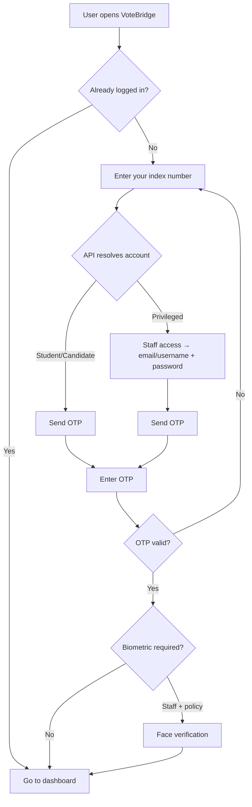
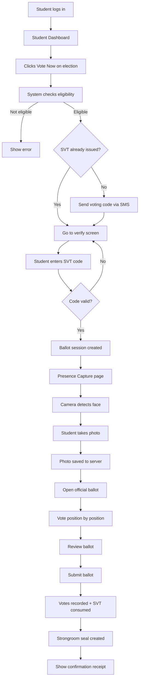
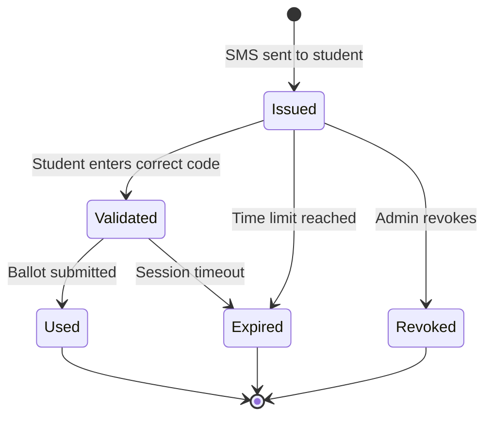
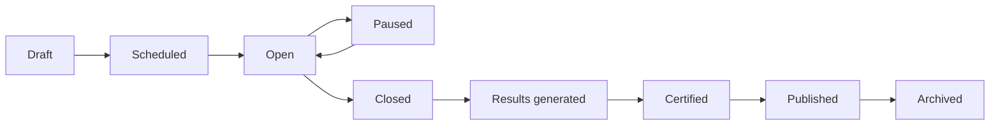
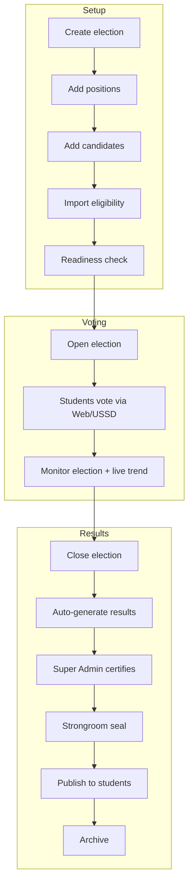
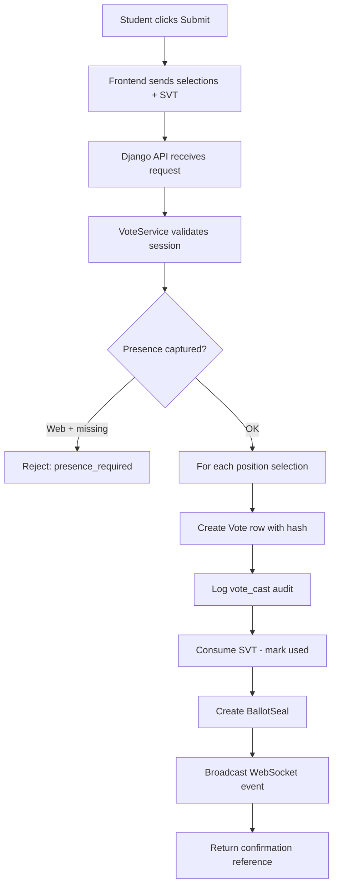
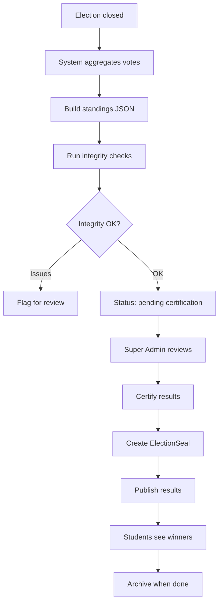
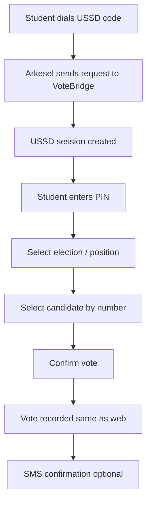
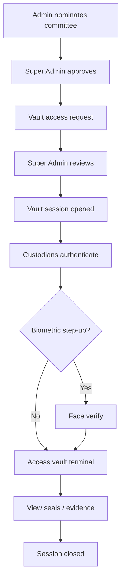
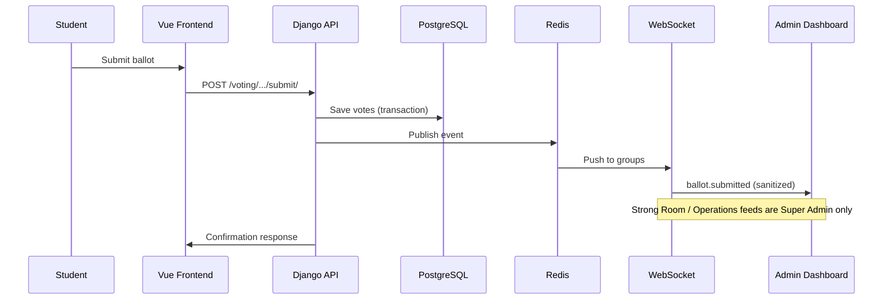

# VoteBridge — Flowcharts

Visual step-by-step flows for the main processes in VoteBridge. Render Mermaid diagrams in GitHub or VS Code.

**Reading guide:**
- **§1–6** — Core prototype flows (login, voting, election lifecycle, results)
- **§7** — USSD channel (optional alternate path)
- **§8–9** — Advanced governance and realtime internals

---

## 1. User login flow

**Layman summary:** Everyone uses the **same sign-in page** with student-first copy (“Enter your index number”). Staff use a subtle **Staff access** link, then email/username and password, then OTP.

---

## 2. Student web voting flow (full)

**Layman summary:** Get code on phone → enter code → quick selfie for integrity → pick candidates → submit → get receipt.

---

## 3. SVT (Secure Voting Token) lifecycle

| Status | Meaning |
|--------|---------|
| **Issued** | Code sent; not yet entered |
| **Validated** | Code accepted; ballot session active |
| **Used** | Student finished voting |
| **Expired** | Code or session timed out |
| **Revoked** | Admin cancelled the token |

---

## 4. Election lifecycle (admin view)

---

## 5. Ballot submission (technical)

---

## 6. Results publication flow

**While election is OPEN:** steps K and L do **not** happen for live rankings — students never see interim winners.

---

## 7. USSD voting flow (simplified)

**Note:** USSD does **not** use the web presence photo step.

---

## 8. Strongroom vault access (advanced governance)

Not part of the primary prototype navigation. Committee nomination UI is demoted; vault access is Super Admin governance.

---

## 9. Real-time update flow

---

## Related documents

- [ELECTION-LIFECYCLE.md](./ELECTION-LIFECYCLE.md) — narrative walkthrough
- [PRIVILEGES-AND-ROLES.md](./PRIVILEGES-AND-ROLES.md) — who can run each step
- [SYSTEM-ARCHITECTURE.md](./SYSTEM-ARCHITECTURE.md) — technical architecture
