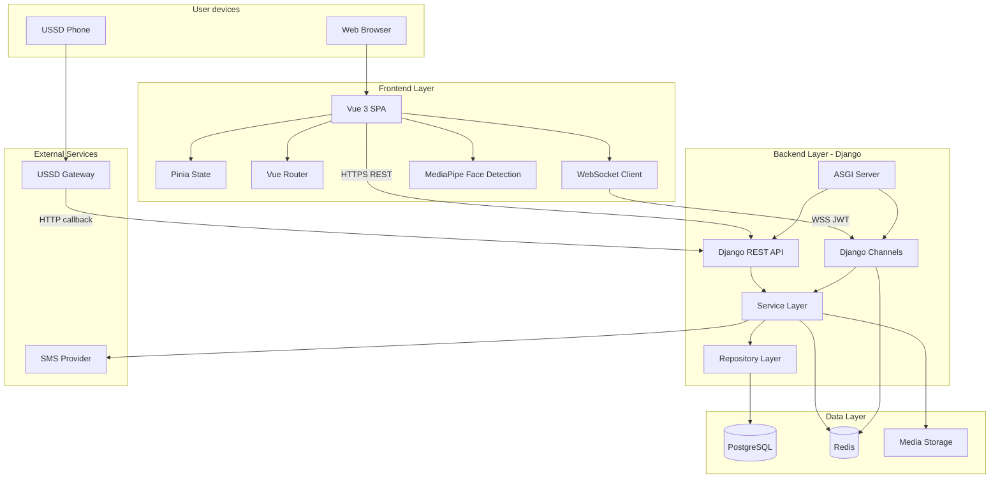
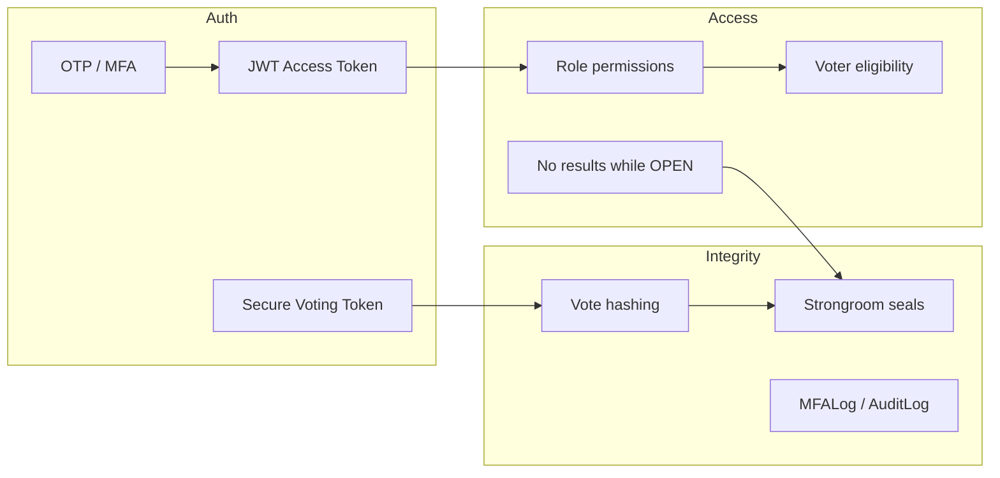
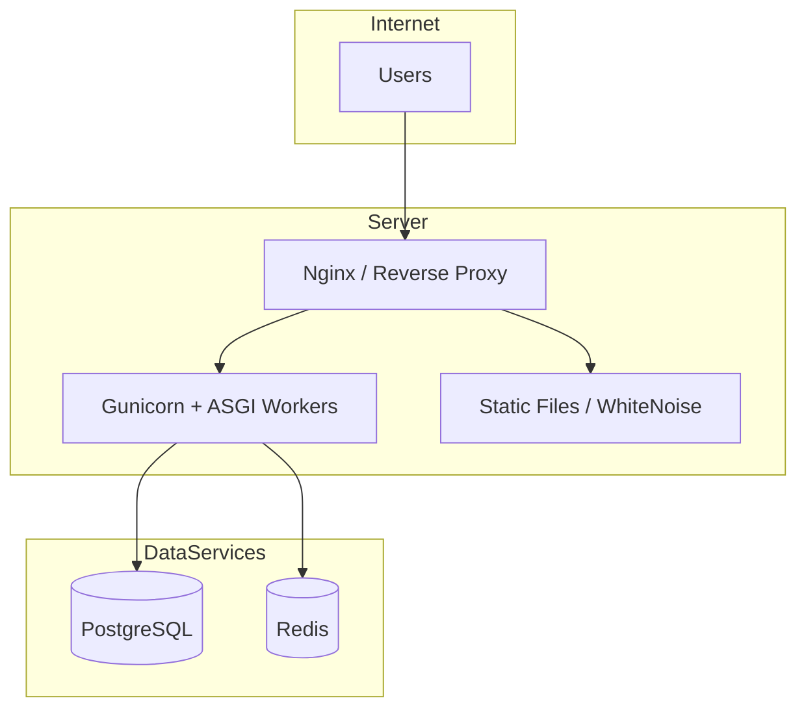

# VoteBridge — System Architecture

This document explains **how VoteBridge is built** and how the parts work together. Written for both technical readers and curious non-developers.

> **Aligned with:** [PRIVILEGES-AND-ROLES.md](./PRIVILEGES-AND-ROLES.md) for WebSocket and operations boundaries.

**Presentation note:** Primary sidebars show the campus e-voting prototype. Advanced modules (Operations Center, Strong Room committee tab, infrastructure pages) remain routable but are demoted from main navigation.

---

## Architecture diagram



---

## Layer-by-layer explanation

### 1. Frontend (what users see)

| Component | Role |
|-----------|------|
| **Vue 3** | Builds interactive pages (dashboard, ballot, admin panels) |
| **Vite** | Bundles and serves the app quickly during development |
| **Pinia** | Stores login state, voting progress, dashboard data |
| **Vue Router** | Controls which page loads; blocks unauthorized roles |
| **Axios** | Sends HTTP requests to Django API |
| **Tailwind CSS** | Consistent styling (colors, spacing, responsive layout) |
| **MediaPipe** | Browser-side face detection for presence capture and staff biometrics |

The frontend contains **no business rules** — it displays data and calls the API. Rules live in Django services.

### 2. Backend (the brain)

| Component | Role |
|-----------|------|
| **Django** | Web framework; handles security, ORM, admin |
| **Django REST Framework** | REST API with serializers and permissions |
| **Services** | All business logic (voting, elections, results, SVT) |
| **Repositories** | Database queries only — no business rules |
| **API Views** | Thin — validate input, call service, return JSON |
| **Permissions** | Role checks on every endpoint |

**Architecture rule:** Views never access models directly. Services orchestrate everything.

### 3. Real-time layer (live updates)

| Component | Role |
|-----------|------|
| **Django Channels** | WebSocket support inside Django |
| **ASGI** | Serves both HTTP and WebSocket on one server |
| **Redis Channel Layer** | Message bus between workers and WebSocket clients |
| **Consumers** | WebSocket handlers (dashboard, security, notifications) |

When a student submits a ballot, the backend saves to PostgreSQL, then publishes events to Redis. Public and student feeds receive **sanitized** payloads; the admin dashboard also receives an unsanitized `live_trend_updated` event with internal standings while the election is Open.

**Role-based feeds** (enforced in `realtime/consumers.py` and router guards):

| Feed | Admin | Super Admin |
|------|-------|-------------|
| Per-election monitor, admin dashboard, security/fraud (election scope) | ✓ | ✓ |
| `live_trend_updated` on admin dashboard WebSocket | ✓ | ✓ |
| Strong Room, Communications, USSD, platform Operations | ✗ | ✓ |

Open-election **student/public** payloads are sanitized — no candidate rankings or winners leak on shared election channels. Internal live standings are admin-dashboard only.

### 4. Data layer

| Component | Role |
|-----------|------|
| **PostgreSQL** | Permanent storage — users, votes, elections, audit logs |
| **Redis** | Cache + WebSocket pub/sub |
| **Media files** | Candidate photos, presence capture images, logos |

### 5. Presentation UI surfaces (prototype)

Primary navigation is trimmed per role. Deep modules stay routable (`meta.presentationHidden` or `roles: ["super_admin"]`) but are demoted from sidebars.

| Role | Sidebar | Emphasized screens |
|------|---------|-------------------|
| **Student / candidate** | Dashboard, Elections, Results, Notifications | Student dashboard, election detail, vote wizard, confirmation, published results |
| **Admin** | Dashboard, Elections, Results, Reports | Election workspace (positions, candidates, eligibility, readiness, monitor) |
| **Super Admin** | Dashboard, Results, Settings | Certification queue, settings hubs (institution, integrations, governance) |

**Demoted from primary nav:** global control-room redirect, election-management stubs, Strong Room committee tab in workspace, platform Operations Center, infrastructure/performance pages.

**Login:** Single `/auth/login` — public copy is index-number only; **Staff access** link reveals privileged sign-in (email/username → password → OTP).

---

## Request flow (example: cast a vote)

```
1. Student clicks Submit in Vue
2. Pinia voting store builds payload (selections + SVT code)
3. Axios POST → /api/v1/voting/elections/{uuid}/submit/
4. DRF checks JWT + CanVote permission
5. SubmitBallotView calls VoteService.submit_ballot()
6. Service validates SVT, presence, eligibility, election status
7. Repository creates Vote rows in PostgreSQL (transaction)
8. Service consumes SVT, creates BallotSeal, logs audit
9. RealtimeBroadcastService sends event to Redis
10. WebSocket consumer pushes to admin groups
11. JSON confirmation returned to Vue
12. Student sees receipt page
```

---

## Security architecture



| Mechanism | Purpose |
|-----------|---------|
| JWT | Identifies logged-in user on each API call |
| SVT | Proves right to cast ballot for one election session |
| Vote hash | Tamper-evident vote record |
| Ballot seal | Cryptographic wrapper per submitted ballot |
| Election seal | Whole-election integrity after certification |
| MFALog | Who did what, when (login, vote, SVT, presence) |

---

## Deployment architecture (typical)



Docker Compose (development) provides PostgreSQL 16 and Redis 7 locally.

---

## Module map (Django apps)

| App | Responsibility |
|-----|----------------|
| `accounts` | Users, roles, OTP, sessions, MFA logs |
| `elections` | Elections, positions, eligibility, channels, **bulk import**, **election purge** |
| `candidates` | Candidate profiles |
| `voting` | Ballots, votes, presence capture |
| `security` | SVT tokens, audit, device/location logs |
| `results` | Result generation, certification, publication |
| `strongroom` | Seals, vault, committee, custody |
| `fraud` | Security alerts, fraud cases |
| `notifications` | SMS, templates, in-app notifications |
| `biometrics` | Staff face enrollment/verification |
| `trusted_devices` | Admin device trust |
| `system` | Institution settings (six hubs), feature flags, operational data reset (Settings → Operations) |
| `ussd` | Phone voting sessions |
| `realtime` | WebSocket consumers |
| `dashboard` | Dashboard aggregation services |
| `operations` | Operations Center — **platform** metrics (Super Admin) and **election** monitor API (Admin) |
| `analytics` | Reporting and analytics — includes `ElectionLiveTrendService`, `ElectionResultsAnalyticsService`, and election-scoped chart APIs |

---

## Why this architecture?

| Choice | Reason |
|--------|--------|
| **Separated frontend/backend** | Vue gives rich UX; Django gives secure, testable APIs |
| **Service layer** | Election rules are complex — one place to enforce them |
| **PostgreSQL** | Reliable transactions for votes |
| **Redis** | Fast cache + WebSocket scaling |
| **WebSockets** | Admins need live monitoring without polling |
| **JWT** | Stateless API auth for SPA |

See [TECH-STACK.md](./TECH-STACK.md) for the full technology list.

---

## Settings and operations boundaries

### System Control (Super Admin only)

Vue routes under `/settings/*` map to six hubs defined in `systemControlHub.js`:

1. Institution  
2. Security  
3. Integrations  
4. Election Governance  
5. Operations (maintenance, backup, storage, operational data reset — advanced / recovery)
6. Advanced  

### Operations API split

| Permission | Scope |
|------------|-------|
| `CanAccessElectionOperations` | Admin + Super Admin — per-election monitor endpoints |
| `CanAccessPlatformOperationsCenter` | Super Admin only — health, infrastructure, queues, sessions, platform logs |

### Student portal shell

Students and candidates use a dedicated **`StudentAppShell`** layout (sidebar, topbar, mobile nav) separate from the admin `AppShell`. Voting flows route through SVT verify → presence capture (web) → ballot wizard.

---

## Related documents

- [ERD.md](./ERD.md) — database relationships
- [FLOWCHARTS.md](./FLOWCHARTS.md) — process flows
- [ELECTION-LIFECYCLE.md](./ELECTION-LIFECYCLE.md) — election journey
