# VoteBridge — Use Case Diagram

A **use case diagram** shows *who* uses the system and *what goals* they achieve. Below is a text explanation plus Mermaid diagrams you can render in GitHub, VS Code, or any Mermaid viewer.

> **Aligned with:** [PRIVILEGES-AND-ROLES.md](./PRIVILEGES-AND-ROLES.md) — Admin election-scoped vs Super Admin platform governance.

**Scope:** The **prototype path** covers login, voting, admin election workspace, and results certification/publication. Advanced use cases (Strong Room vault, Operations Center, operational data reset) exist in code but are **not** primary demo navigation.

---

## Actors (who uses the system)

| Actor | Description |
|-------|-------------|
| **Student** | Eligible voter |
| **Candidate** | Voter who may also appear on the ballot |
| **Admin** | Election officer running elections |
| **Super Admin** | Platform administrator |
| **SMS Gateway** | External system (sends voting codes) |
| **USSD Gateway** | External phone menu (Arkesel) |
| **Public Visitor** | Unauthenticated user (landing page, public results portal) |

---

## High-level use case diagram (prototype core)

```mermaid
flowchart TB
    subgraph Actors
        STU[Student]
        CAN[Candidate]
        ADM[Admin]
        SA[Super Admin]
        SMS[SMS Gateway]
        USSD[USSD Gateway]
        PUB[Public Visitor]
    end

    subgraph Voting["Prototype — voting"]
        UC1[Sign in — index number or Staff access]
        UC2[Request voting code SVT]
        UC3[Verify SVT]
        UC4[Capture presence photo]
        UC5[Cast ballot]
        UC6[View vote receipt]
        UC7[View published results]
    end

    subgraph ElectionManagement["Prototype — election workspace"]
        UC10[Create election]
        UC11[Manage positions and candidates]
        UC12[Manage voter eligibility]
        UC13[Open / pause / close election]
        UC14[Monitor live election]
    end

    subgraph Results["Prototype — results"]
        UC20[Generate results]
        UC21[Certify results]
        UC22[Publish results]
    end

    subgraph Platform["Prototype — settings"]
        UC30[Configure institution]
        UC31[Manage users and roles]
        UC32[Configure SMS/USSD providers]
    end

    STU --> UC1
    STU --> UC2
    STU --> UC3
    STU --> UC4
    STU --> UC5
    STU --> UC6
    STU --> UC7

    CAN --> UC1
    CAN --> UC2
    CAN --> UC3
    CAN --> UC4
    CAN --> UC5
    CAN --> UC6
    CAN --> UC7

    ADM --> UC10
    ADM --> UC11
    ADM --> UC12
    ADM --> UC13
    ADM --> UC14

    SA --> UC21
    SA --> UC22
    SA --> UC30
    SA --> UC31
    SA --> UC32

    SMS -.-> UC2
    USSD -.-> UC5
    PUB --> UC7
```

> **Note:** Super Admin retains **API capability** for all Admin election operations, but the **presentation UI** emphasizes governance (certify, publish, Settings) — not day-to-day election workspace. Admins own election setup and monitoring in the prototype.

---

## Advanced governance use cases (not primary demo nav)

| Use case | Primary actor | Where |
|----------|---------------|-------|
| Seal strongroom / verify integrity | Super Admin | Strong Room module, Settings |
| Nominate strong room committee | Admin (API); UI demoted | Election governance |
| Approve committee and vault access | Super Admin | Settings → Election Governance |
| Platform fraud and security investigations | Super Admin | Settings → Security |
| Operations Center (health, queues, sessions) | Super Admin | Demoted route / API |
| Maintenance and operational data reset | Super Admin | Settings → Operations |

---

## Student / Candidate use cases (detail)

| Use case | Description |
|----------|-------------|
| **Authenticate** | Enter index number → receive OTP → access student portal (staff use **Staff access** → email/username → password → OTP) |
| **View dashboard** | See active elections, voting status, countdown |
| **Start vote flow** | Click Vote Now on an eligible election |
| **Receive SVT** | System sends secure voting code to registered phone |
| **Validate SVT** | Enter code to start ballot session |
| **Confirm presence** | Web only: camera checks face is visible; take photo |
| **Complete ballot** | Select candidates per position; review; submit |
| **Continue later** | Resume in-progress ballot before session expires |
| **View confirmation** | See vote receipt after successful submit |
| **View results** | See published results only |
| **Verify ballot** | Optional post-vote verification with SVT |

### Candidate-only additions (election-scoped)

| Use case | Description |
|----------|-------------|
| **View candidacy status** | See draft / pending / approved / rejected for their race |
| **Preview manifesto** | Review own candidate profile on the ballot |
| **Receive candidacy notices** | In-app notices tied to elections where they are registered |

Candidates **cannot** access admin or certification tools because of the role — only extra **visibility** on their own candidacy.

---

## Admin use cases (detail)

Election-scoped — Admin runs elections; platform governance belongs to Super Admin.

| Use case | Description |
|----------|-------------|
| **Plan election** | Create draft election with dates and type |
| **Configure ballot** | Add positions, candidates, eligibility rules |
| **Bulk import eligibility** | Upload CSV/Excel voter lists (`POST .../eligibility/import/`) |
| **Readiness check** | Validate election is ready to open |
| **Control lifecycle** | Schedule → Open → Pause → Close |
| **Monitor turnout** | Election workspace **Monitor** tab + per-election WebSocket |
| **Manage SVTs** | Revoke or reissue tokens for assigned elections |
| **Review security (election scope)** | Security alerts and fraud cases within operational scope |
| **Preview results** | View generated results before certification (cannot publish) |
| **Export reports** | Download integrity and turnout reports |
| **Lookup voters** | Read-only user lookup for eligibility search |

### Admin cannot (UI and API for platform areas)

- Open **Operations Center** (health, queues, sessions, platform logs)
- Process communications **queue retries** or provider tests
- Approve strong room committee or run casual vault sessions
- Create platform user accounts or assign Super Admin
- Access Strong Room / USSD / Communications **realtime feeds**

---

## Super Admin use cases (detail)

### Prototype emphasis (primary UI)

| Use case | Description |
|----------|-------------|
| **Certify results** | Official sign-off after integrity checks |
| **Publish results** | Make results visible to students/public |
| **Archive election** | Long-term storage state |
| **Settings** | Institution, security, integrations, election governance, operations, advanced |
| **User & role management** | Create users; assign roles in the predefined set |
| **Provider config** | SMS, USSD, email providers |

### Advanced / governance (API and Settings sub-pages)

| Use case | Description |
|----------|-------------|
| **Election workspace (full)** | API supports all Admin election operations; not in primary Super Admin sidebar |
| **Strong room governance** | Approve committee, vault access requests, vault sessions |
| **Biometric policy** | Enroll staff, configure step-up rules |
| **Platform investigations** | Fraud, security timeline, audit trail (Settings → Security) |
| **Operations Center** | Platform health, infrastructure, queues, sessions (demoted from nav) |
| **Backup & maintenance** | Maintenance mode, backups, storage |
| **Operational data reset** | Clear elections, votes, and results (staging/dev recovery — not demo path) |

---

## System use cases (automated)

| Use case | Trigger | Actor |
|----------|---------|-------|
| **Send SVT SMS** | Student requests code | System → SMS Gateway |
| **Expire SVT** | Time limit reached | System |
| **Hash vote** | Ballot submitted | System |
| **Seal ballot** | Vote recorded | Strongroom service |
| **Auto-generate results** | Election closed | Results service |
| **Broadcast live update** | Vote cast, status change | WebSocket via Redis |
| **Flag fraud** | Suspicious pattern | Security service |

---

## Use case relationships (plain language)

- **Include:** “Cast ballot” *includes* “Validate SVT” — you cannot vote without a valid code.
- **Include:** “Cast ballot (web)” *includes* “Capture presence photo”.
- **Extend:** “Investigate fraud” *extends* “Monitor election” when an alert is raised.
- **Generalization:** Candidate extends Student with candidacy visibility — not a separate governance tier.

See [PRIVILEGES-AND-ROLES.md](./PRIVILEGES-AND-ROLES.md) for the authoritative permission matrix.

---

## What this diagram does NOT show

- Internal API names or database tables (see [ERD.md](./ERD.md))
- Exact screen layouts (see Vue views in `frontend/src/vue/views/`)
- Network ports and servers (see [SYSTEM-ARCHITECTURE.md](./SYSTEM-ARCHITECTURE.md))

For the full election story, read [ELECTION-LIFECYCLE.md](./ELECTION-LIFECYCLE.md).
